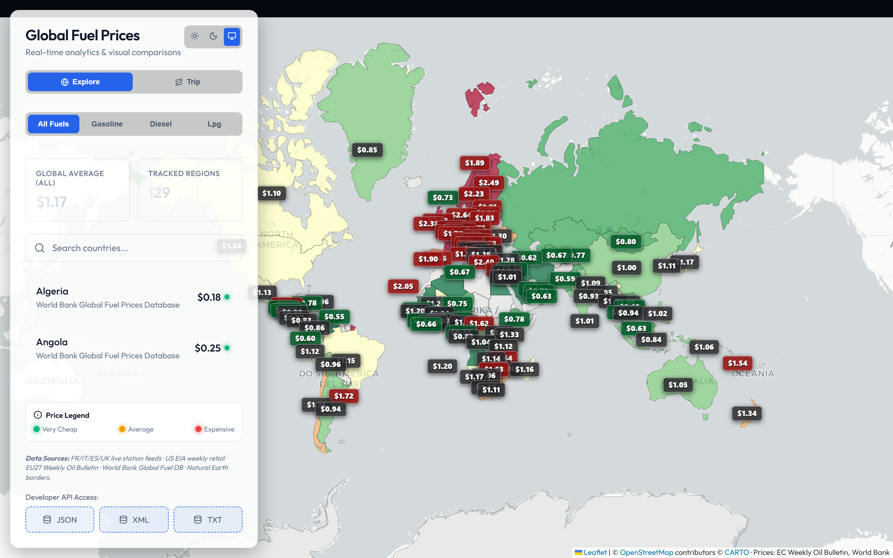
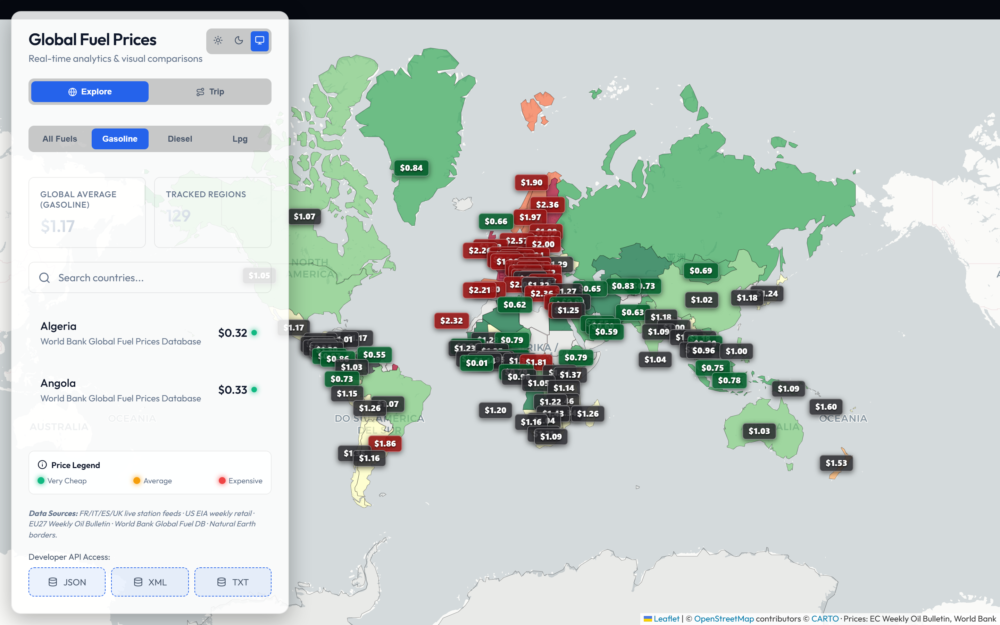
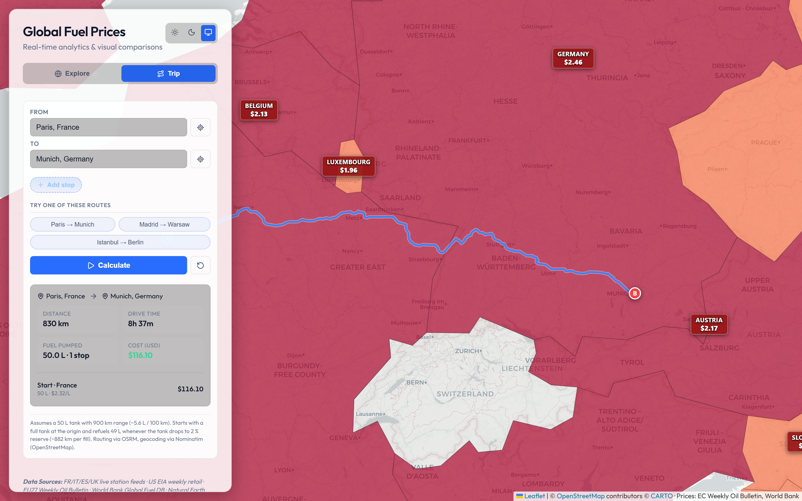
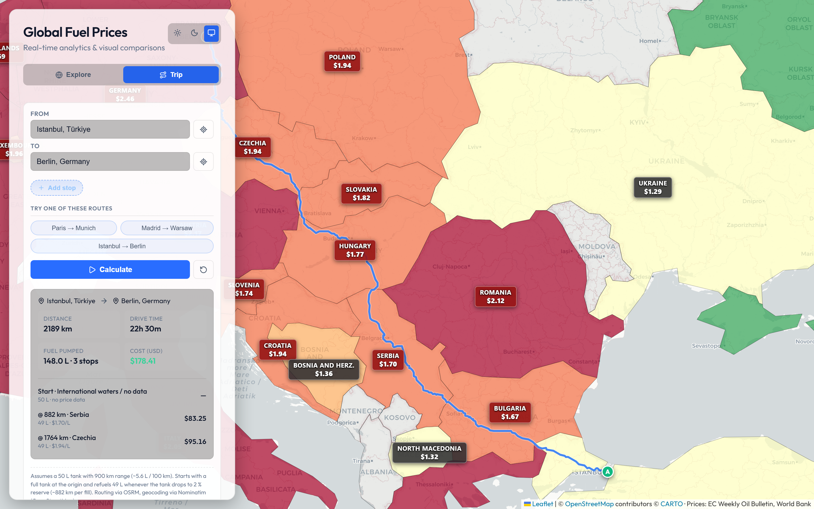

<div align="center">

# ⛽ Fuel Prices

### Daily-refreshed world map of retail fuel prices, with a per-country trip cost calculator.

**[🌐 Live Demo](https://aykutsp.github.io/world-fuel-prices/)** · **[📖 API Reference](#-open-data-api)** · **[📦 Client Libraries](#-client-libraries)** · **[🐛 Report Bug](https://github.com/aykutsp/world-fuel-prices/issues/new?template=bug_report.yml)** · **[💡 Request Feature](https://github.com/aykutsp/world-fuel-prices/issues/new?template=feature_request.yml)**

<br />

[](https://github.com/aykutsp/world-fuel-prices/actions/workflows/deploy.yml)
[](https://github.com/aykutsp/world-fuel-prices/releases/latest)
[](./LICENSE)
[](https://github.com/aykutsp/world-fuel-prices/commits/main)
[](https://github.com/aykutsp/world-fuel-prices/issues)
[](https://github.com/aykutsp/world-fuel-prices/stargazers)

[](https://www.typescriptlang.org/)
[](https://react.dev/)
[](https://vite.dev/)
[](https://leafletjs.com/)
[](https://nodejs.org/)
[](./libraries/python)
[](./libraries/go)
[](./libraries/flutter)
[](./libraries/csharp)

[](./CONTRIBUTING.md)
[](./CODE_OF_CONDUCT.md)
[](#-configuration)

</div>

---

An interactive world map of retail fuel prices, built on top of public data from national governments, the European Commission and the World Bank. Countries are shaded by average pump price and labeled with the current value for the selected fuel type. The underlying JSON dataset is regenerated automatically every day so the live site always reflects the latest numbers available from upstream feeds.

## ✨ Features

- 🗺 **Choropleth world map** – country polygons are filled on a 7-step green → red scale relative to the global average for the currently selected fuel.
- 🏷 **On-map price labels** – each country shows its current price in USD per litre, rescaled automatically as you zoom.
- ⛽ **Multiple fuel types** – toggle between All Fuels, Gasoline, Diesel and LPG. The choropleth and labels restyle in place.
- 🛰 **Live, station-level data where possible** – France, Italy, Spain, the UK and the United States pull directly from national government feeds that update daily. Remaining countries fall back to the EU Weekly Oil Bulletin and the World Bank Global Fuel Prices Database.
- 🧭 **Trip calculator** – enter a From / To (or use your current location), pick one of the built-in routes, and get a full receipt: total distance, drive time, tanks, per-country fuel cost breakdown, and a route drawn right on the map. Uses OSRM for routing and Nominatim for geocoding. Assumes a 50 L tank with a 900 km range.
- 📦 **Static open data endpoints** – the build ships `prices.json`, `prices.xml` and `prices.txt` under `api/v1/`. No auth, no rate limits.
- 🌓 **Light / dark / system theme** with CARTO base tiles that match.
- 🤖 **Self-updating** – a GitHub Actions workflow regenerates the dataset and redeploys the site on a daily schedule.

## 📸 Screenshots

**Explore view — choropleth coloured by the currently selected fuel, with in-map price labels per country**



Switch the toggle to **Gasoline / Diesel / LPG** and the map restyles in place:



**Trip calculator (Paris → Munich)** — routing via OSRM, one refuel covers the whole 830 km:



**Trip calculator (Istanbul → Berlin)** — longer route, three refuels at 882 km boundaries, per-country cost breakdown in the receipt:



## 🧭 Trip calculator (Travel mode)

Switch the sidebar to **Trip** mode to plan a real-world drive on top of the price map.

### Inputs

- **From / To** – free-text fields. Type a city, postcode, landmark or address; Nominatim (OpenStreetMap) resolves it behind the scenes.
- **📍 Current location** – on each field, the small locate button uses the browser's geolocation API to drop in your current coordinates (the label is reverse-geocoded so it's human-readable).
- **Add stop** – chain as many as 8 intermediate waypoints between From and To. Each stop has its own text input, locate button and remove (✕) button. OSRM will route through every waypoint in order.
- **Presets** – one-click routes to try the feature instantly:
  - Paris → Munich
  - Madrid → Warsaw
  - Istanbul → Berlin

### Routing & cost model

When you hit **Calculate** the app:

1. Geocodes every waypoint that isn't already resolved (Nominatim).
2. Asks OSRM's public demo server for a full-geometry driving route through all of them.
3. Walks the resulting polyline, running a point-in-polygon test against the bundled Natural Earth borders to figure out which country each segment belongs to.
4. Simulates refuelling along the way.

The fuel model is the one you'd actually run in your head on a long drive:

| Assumption | Value |
|---|---|
| Tank size | 50 L |
| Range per full tank | 900 km |
| Consumption | ~5.56 L / 100 km |
| Reserve refuel threshold | **2 %** (1 L left ≈ 18 km buffer) |
| Usable distance between refuels | **882 km** |
| Litres pumped per refill | 49 L (refilling the used 98 %) |

The car starts with **a full 50 L tank bought at the origin country's current price**. As soon as the tank drops to 2 %, the simulation inserts a refill (49 L) priced at whatever country the car is physically in at that moment. The process repeats until you arrive — the final tank is simply the one that takes you to the destination, you don't refuel at the end.

### What the receipt shows

- **Distance** and **drive time** straight from OSRM.
- **Fuel pumped** – total litres purchased across all refuels and the number of fuel stops.
- **Cost (USD)** – sum of every refill at its local price.
- **Per-refuel breakdown** – each entry tells you *where* (country), *when* (km along the route), *how much* (litres) and *how expensive* (price/L and total for that stop). The first row is labelled "Start ·" and represents the full tank you bought at the origin.
- **A / B pins** on the map mark origin and destination; the route itself is drawn as a coloured polyline and the map auto-fits to its bounds.

All of the pricing for the trip receipt comes from the same daily-refreshed dataset that drives the choropleth, so the numbers line up with what you see on the map.

## 🛠 Tech Stack

| Layer | Choice |
|---|---|
| Framework | React 19 + Vite 8 |
| Language | TypeScript 5 |
| Mapping | Leaflet + react-leaflet (GeoJSON choropleth) |
| Styling | Plain CSS with CSS variables |
| Data pipeline | Node.js + SheetJS (`xlsx`) |
| Hosting | GitHub Pages (via GitHub Actions) |

## ⚙️ Installation

Prerequisites: **Node.js 20 LTS or newer** and **npm**.

```bash
git clone https://github.com/<your-user>/fuel-prices.git
cd fuel-prices
npm install
```

## 🚀 Usage

Generate the dataset (this hits the upstream feeds once and writes files under `public/api/v1/`):

```bash
npm run generate-data
```

Start the dev server:

```bash
npm run dev
```

Build for production (regenerates data then bundles):

```bash
npm run build
npm run preview   # optional: smoke-test the built output
```

The static API ships inside `dist/` and is also available during `npm run dev`:

| Endpoint | Format |
|---|---|
| `/api/v1/prices.json` | JSON (full payload) |
| `/api/v1/prices.xml`  | XML |
| `/api/v1/prices.txt`  | Plain text summary |
| `/api/v1/countries.geojson` | Country borders (Natural Earth 110m) |

## 📁 Project Structure

```
.
├── .github/
│   └── workflows/
│       └── deploy.yml          # Daily data refresh + GitHub Pages deploy
├── public/
│   └── api/v1/                 # Generated dataset (ignored by git, built in CI)
├── scripts/
│   └── generateData.js         # Data pipeline (fetch → normalize → write)
├── src/
│   ├── App.tsx
│   ├── components/
│   │   ├── Dashboard/Sidebar.tsx
│   │   └── Map/FuelMap.tsx
│   ├── types.ts
│   ├── main.tsx
│   └── index.css
├── index.html
├── package.json
├── tsconfig*.json
└── vite.config.ts
```

## 🔧 Configuration

### GitHub Pages subpath

If you deploy under a project page (e.g. `https://your-name.github.io/fuel-prices/`) rather than a user/organisation page, set the base path at build time:

```bash
VITE_BASE_PATH=/fuel-prices/ npm run build
```

The workflow in `.github/workflows/deploy.yml` does this automatically using the repository name.

### Data sources

Per-country priority is `station-level feed > EU Weekly Oil Bulletin > World Bank`:

| Country | Source | License |
|---|---|---|
| 🇫🇷 France | `data.economie.gouv.fr` Prix des carburants (live stations) | Etalab Open Licence 2.0 |
| 🇮🇹 Italy | MIMIT Osservaprezzi (daily CSV) | IODL 2.0 |
| 🇪🇸 Spain | Ministerio REST API (live stations) | Public |
| 🇬🇧 United Kingdom | CMA Road Fuel Price Transparency Scheme (Asda, Sainsbury's, Applegreen, Esso) | Open Government Licence |
| 🇺🇸 United States | EIA weekly retail prices | U.S. public domain |
| 🇪🇺 EU27 (fallback) | European Commission Weekly Oil Bulletin | CC BY 4.0 |
| 🌍 Rest of world | World Bank Global Fuel Prices Database | ODbL |
| Borders | Natural Earth 110m admin_0 | CC0 |

Currency conversion uses live USD rates from `open.er-api.com`, with hardcoded fallbacks if the FX endpoint is unreachable.

## 📌 Roadmap

- [ ] Germany: optional Tankerkönig integration (requires a free API key)
- [ ] Turkey: EPDK SOAP service once registration credentials are available
- [ ] Historical series + sparkline per country
- [ ] Local-currency display toggle
- [ ] City-level drilldown for feeds that expose per-station coordinates
- [ ] Side-by-side country comparison view
- [ ] Configurable tank size / consumption in the trip calculator
- [ ] Save favourite routes

## 📜 Changelog

**v1.2.0** – Pre-computed trip endpoints (`/api/v1/trips/*.json`), official client libraries for JavaScript/TypeScript, Python, Go, Dart/Flutter and C#/.NET under `libraries/`, redesigned "Add stop" button, new preset section label, added C# / PHP / Rust / Go API usage examples, community health files (CONTRIBUTING, SECURITY, CODE_OF_CONDUCT, issue templates, Dependabot) and a promotion playbook.

**v1.1.1** – Intermediate stops (up to 8 waypoints per trip), refuel-based cost model (full tank at origin, 2 % reserve refills at local prices), more prominent country name labels on the map.

**v1.1.0** – Trip calculator with from/to geocoding, current-location support, three preset routes, OSRM routing and per-country cost breakdown drawn on the map.

**v1.0.0** – Initial release. Choropleth world map, 129 countries, 5 live station-level feeds, EU Bulletin + World Bank fallback, daily self-updating pipeline.

## 📦 Client Libraries

Language-specific wrappers around the open data API live in [`libraries/`](./libraries/). Each one is a single, thin client that talks to the same static endpoints and exposes typed helpers (`getCountry`, `cheapest`, `getTrip`, etc.).

| Language | Package | Install | Source |
|---|---|---|---|
| JavaScript / TypeScript | [`world-fuel-prices`](https://www.npmjs.com/package/world-fuel-prices) (npm) | `npm install world-fuel-prices` | [`libraries/typescript`](./libraries/typescript) |
| Python 3.9+ | [`world-fuel-prices`](https://pypi.org/project/world-fuel-prices/) (PyPI) | `pip install world-fuel-prices` | [`libraries/python`](./libraries/python) |
| Go 1.21+ | `github.com/aykutsp/world-fuel-prices/libraries/go` | `go get github.com/aykutsp/world-fuel-prices/libraries/go@latest` | [`libraries/go`](./libraries/go) |
| Dart / Flutter | [`world_fuel_prices`](https://pub.dev/packages/world_fuel_prices) (pub.dev) | `dart pub add world_fuel_prices` | [`libraries/flutter`](./libraries/flutter) |
| .NET 8+ | [`WorldFuelPrices`](https://www.nuget.org/packages/WorldFuelPrices) (NuGet) | `dotnet add package WorldFuelPrices` | [`libraries/csharp`](./libraries/csharp) |

All five expose the same surface:

- `getCountry(iso2)` → single country snapshot
- `getPrices()` → full dataset (cached per-instance)
- `cheapest(fuel, n)` / `mostExpensive(fuel, n)` → sorted top-N
- `globalAverage(fuel)` → mean across tracked regions
- `listTrips()` / `getTrip(slug)` → the pre-computed trip endpoints

See each library's README for language-specific examples. The libraries are published under MIT; the data they return is covered by the upstream licences listed in the Configuration section.

## 🔌 Open Data API

Every build ships a static, no-auth, no-rate-limit dataset under `api/v1/` in three formats. Hit them directly from scripts, notebooks or other apps — they refresh once a day on the live site.

**Base URL:** `https://aykutsp.github.io/world-fuel-prices/api/v1/`

| Endpoint | Content-Type | Use when |
|---|---|---|
| [`prices.json`](https://aykutsp.github.io/world-fuel-prices/api/v1/prices.json) | `application/json` | Programmatic access from JS / Python / anything |
| [`prices.xml`](https://aykutsp.github.io/world-fuel-prices/api/v1/prices.xml) | `application/xml` | Legacy tooling, spreadsheets, XSLT pipelines |
| [`prices.txt`](https://aykutsp.github.io/world-fuel-prices/api/v1/prices.txt) | `text/plain` | Eye-balling in the terminal |
| [`countries.geojson`](https://aykutsp.github.io/world-fuel-prices/api/v1/countries.geojson) | `application/geo+json` | Natural Earth 110m country borders (CC0) for your own maps |
| [`trips/index.json`](https://aykutsp.github.io/world-fuel-prices/api/v1/trips/index.json) | `application/json` | Pre-computed trip catalog (Paris→Munich, Madrid→Warsaw, Istanbul→Berlin) |
| [`trips/{slug}.json`](https://aykutsp.github.io/world-fuel-prices/api/v1/trips/istanbul-berlin.json) | `application/json` | Full route geometry + per-refuel cost breakdown for one preset |

### JSON schema (simplified)

```jsonc
{
  "lastUpdated": "2026-04-05T10:00:00.000Z",
  "sources": [ "France: data.economie.gouv.fr …", "…" ],
  "globalAverageUSD": 1.17,
  "regions": [
    {
      "id": "FR",                 // ISO 3166-1 alpha-2
      "iso3": "FRA",
      "name": "France",
      "currency": "EUR",
      "source": "data.economie.gouv.fr (live stations)",
      "pricesUSD":   { "gasoline": 2.32, "diesel": 2.66, "lpg": 1.17, "average": 2.05 },
      "pricesLocal": { "gasoline": 2.01, "diesel": 2.31, "lpg": 1.02, "average": 1.78 },
      "lat": 46.23,
      "lng":  2.21,
      "cities": []
    }
  ]
}
```

### Usage examples

**curl** – fetch the whole payload and pretty-print it:

```bash
curl -s https://aykutsp.github.io/world-fuel-prices/api/v1/prices.json | jq .
```

Just one country:

```bash
curl -s https://aykutsp.github.io/world-fuel-prices/api/v1/prices.json \
  | jq '.regions[] | select(.id == "DE")'
```

Top 10 cheapest gasoline markets in the world today:

```bash
curl -s https://aykutsp.github.io/world-fuel-prices/api/v1/prices.json \
  | jq -r '.regions
      | map(select(.pricesUSD.gasoline > 0))
      | sort_by(.pricesUSD.gasoline)
      | .[:10]
      | .[] | "\(.id)\t\(.pricesUSD.gasoline)\t\(.name)"'
```

**JavaScript / TypeScript** (browser or Node):

```ts
const res = await fetch('https://aykutsp.github.io/world-fuel-prices/api/v1/prices.json');
const data = await res.json();

const france = data.regions.find(r => r.id === 'FR');
console.log(`⛽ ${france.name}: $${france.pricesUSD.gasoline} / L (source: ${france.source})`);
```

**Python**:

```python
import urllib.request, json

url = "https://aykutsp.github.io/world-fuel-prices/api/v1/prices.json"
with urllib.request.urlopen(url) as r:
    data = json.load(r)

# Average gasoline price across all tracked countries
prices = [r["pricesUSD"]["gasoline"] for r in data["regions"] if r["pricesUSD"]["gasoline"] > 0]
print(f"World gasoline average: ${sum(prices) / len(prices):.2f} / L")
```

**Pandas** – drop straight into a DataFrame for analysis:

```python
import pandas as pd

df = pd.json_normalize(
    pd.read_json("https://aykutsp.github.io/world-fuel-prices/api/v1/prices.json")["regions"]
)
df[["id", "name", "pricesUSD.gasoline", "pricesUSD.diesel", "source"]].head(20)
```

**C# / .NET 8+** (uses `System.Net.Http.Json`):

```csharp
using System.Net.Http.Json;

record Prices(double Gasoline, double Diesel, double Lpg, double Average);
record Region(string Id, string Name, string? Source, Prices PricesUSD);
record Payload(string LastUpdated, double GlobalAverageUSD, Region[] Regions);

using var http = new HttpClient();
var payload = await http.GetFromJsonAsync<Payload>(
    "https://aykutsp.github.io/world-fuel-prices/api/v1/prices.json");

var de = payload!.Regions.FirstOrDefault(r => r.Id == "DE");
Console.WriteLine($"{de!.Name}: ${de.PricesUSD.Gasoline:F2}/L (source: {de.Source})");
```

**PHP** (requires `ext-curl` or `allow_url_fopen`):

```php
<?php
$json = file_get_contents('https://aykutsp.github.io/world-fuel-prices/api/v1/prices.json');
$data = json_decode($json, true);

foreach ($data['regions'] as $r) {
    if ($r['id'] === 'DE') {
        printf(
            "%s — gasoline: \$%.2f/L, diesel: \$%.2f/L (source: %s)\n",
            $r['name'],
            $r['pricesUSD']['gasoline'],
            $r['pricesUSD']['diesel'],
            $r['source']
        );
        break;
    }
}
```

**Rust** (using `reqwest` + `serde_json`):

```toml
# Cargo.toml
[dependencies]
reqwest = { version = "0.12", features = ["blocking", "json"] }
serde_json = "1"
```

```rust
use serde_json::Value;

fn main() -> Result<(), Box<dyn std::error::Error>> {
    let url = "https://aykutsp.github.io/world-fuel-prices/api/v1/prices.json";
    let data: Value = reqwest::blocking::get(url)?.json()?;

    if let Some(regions) = data["regions"].as_array() {
        let mut rows: Vec<(&str, f64)> = regions
            .iter()
            .filter_map(|r| {
                let name = r["name"].as_str()?;
                let price = r["pricesUSD"]["gasoline"].as_f64()?;
                (price > 0.0).then_some((name, price))
            })
            .collect();
        rows.sort_by(|a, b| a.1.partial_cmp(&b.1).unwrap());
        for (name, price) in rows.iter().take(10) {
            println!("{:30} ${:.2} / L", name, price);
        }
    }
    Ok(())
}
```

**Go** (standard library only):

```go
package main

import (
    "encoding/json"
    "fmt"
    "net/http"
)

type Prices struct {
    Gasoline float64 `json:"gasoline"`
    Diesel   float64 `json:"diesel"`
    LPG      float64 `json:"lpg"`
    Average  float64 `json:"average"`
}

type Region struct {
    ID        string `json:"id"`
    Name      string `json:"name"`
    Source    string `json:"source"`
    PricesUSD Prices `json:"pricesUSD"`
}

type Payload struct {
    LastUpdated      string   `json:"lastUpdated"`
    GlobalAverageUSD float64  `json:"globalAverageUSD"`
    Regions          []Region `json:"regions"`
}

func main() {
    res, err := http.Get("https://aykutsp.github.io/world-fuel-prices/api/v1/prices.json")
    if err != nil {
        panic(err)
    }
    defer res.Body.Close()

    var payload Payload
    if err := json.NewDecoder(res.Body).Decode(&payload); err != nil {
        panic(err)
    }

    fmt.Printf("Global average: $%.2f / L across %d countries\n",
        payload.GlobalAverageUSD, len(payload.Regions))

    for _, r := range payload.Regions {
        if r.ID == "TR" {
            fmt.Printf("%s — gasoline $%.2f/L (source: %s)\n",
                r.Name, r.PricesUSD.Gasoline, r.Source)
            break
        }
    }
}
```

**Attribution** – when you publish anything built on these files, credit the original upstream sources (EU Commission Weekly Oil Bulletin, World Bank Global Fuel Prices Database, Etalab, MIMIT, Minetur, UK CMA scheme, US EIA, Natural Earth) as listed in the Configuration section.

## 🤝 Contributing

Pull requests are welcome. For non-trivial changes, please open an issue first so we can discuss scope. A few notes:

- Keep the data pipeline in `scripts/generateData.js` self-contained; one function per source, failing gracefully if a feed is down.
- Run `npm run lint` and `npm run build` before submitting.
- When adding a new country feed, include the upstream license in the source header comment and in the README table above.

## 📄 License

MIT. See [`LICENSE`](./LICENSE).

Feel free to use this project however you like — fork it, ship it, tear it apart, build something bigger on top of it. If you end up using it in something public, a small credit or a link back would make my day, but it's not a requirement. Thanks for taking a look.

The aggregated dataset is redistributed under the terms of each upstream source — see the data sources table above, and attribute those sources when reusing the generated files.
