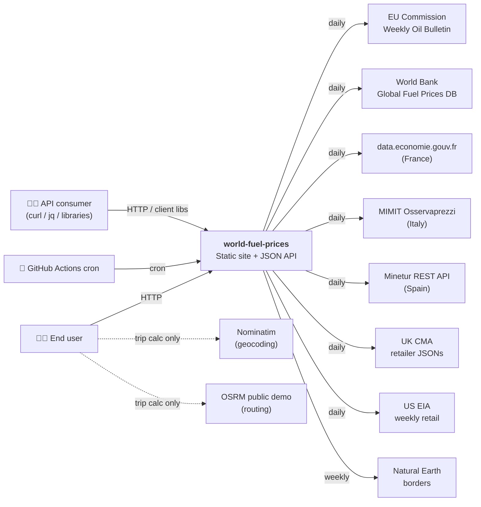
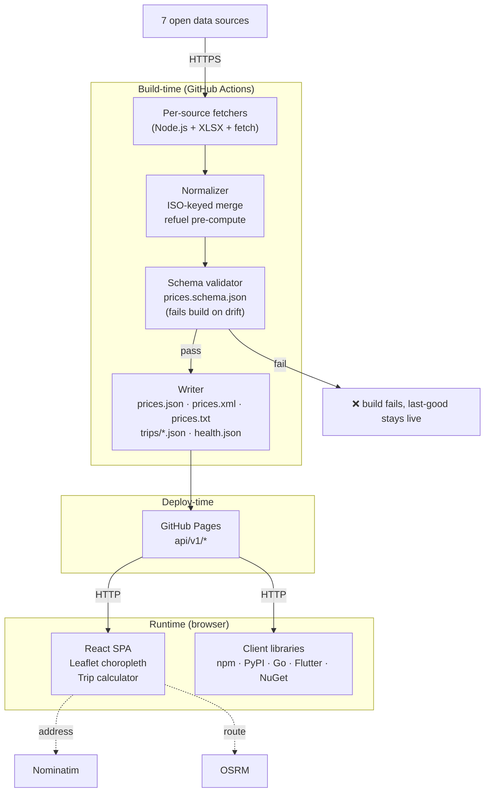

# System overview

C4-model diagrams for world-fuel-prices.

## Level 1 — system context

## Level 2 — containers

**Key invariants**:

- The pipeline is a pure function of the set of upstream URLs at time T.
- Schema validation is a gate. A broken build never reaches users.
- Nominatim and OSRM are only called from the browser, so the static site stays truly static.
